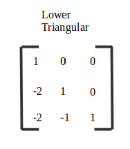
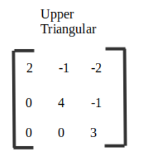

# Numerical-Methods
Numerical Methods written in Python for Univeristy Project

## 1. Matrix Addition
## 2. Matrix Multiplication

## 3. Heron's Algorithm
## 3. Horner's Algorithm
## 4. L Matrix Solving Function

## 5. U Matrix Solving Function

## 6. Gauss Algorithm
## 7. Gauss Jordan Algorithm
## 8. Gauss Pivot Algorithm
